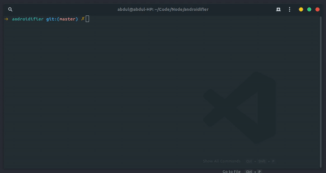

# androidifier
⚡ Convert any web page into an android application in a couple of minutes ⚡

Inspired by this project: [Nativefier](https://github.com/jiahaog/nativefier)

⚠️ Warning: This project only works in linux for now. Needs a lot to be worked to support all other platforms ⚠️

### Try it out!

Make sure you have android sdk tools installed in your system.

1) Clone this repository.
2) Run `yarn start`
3) Enter the android app's name
4) Enter the website you want to convert.
5) APK will be generated!

### How does it work?

1) Receives the name & url of the website from standard input
2) It internally maintains an android project which has the minimal implementation of webview.
3) Updates the app name and site url within the android project.
4) Fetches the app icon either from [here](https://github.com/rehman-00001/nativefier-icons) or from the `favicon` of the webpage.
4) Runs the gradle build command which compiles the project and generates the apk.

### What's remaining ?

1) Need to download android sdk tools if it is not installed already.
2) To add support for windows & mac operating systems.
3) Generate signed APK - only debug apk is generated now.
4) Directly install the APK on the device, if device is connected.

### Contributions 

Contributions are welcome! 😇